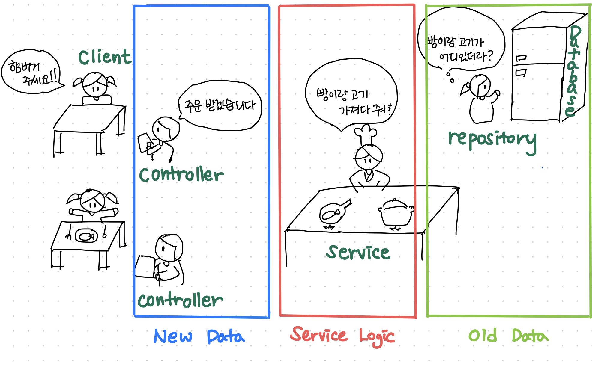

# 서버 이해

- **소프트웨어 디자인 패턴**(software Design pattern)은 소프트웨어 공학의 소프트웨어 디자인에서 특정 문맥에서 공통으로 발생하는 문제에 대해 재사용 가능한 해결책이다.
소스나 기계코드로 바로 전환될 수 있는 완성된 디자인은 아니며, 다른 상황에 맞게 사용될 수 있는 문제들을 해결하는데에 쓰이는 서술이나 템플릿이다. 
디자인패턴은 프로그래머가 어플리케이션이나 시스템을 디자인 할 때 공통된 문제들을 해결하는데에 쓰이는 형식화 된 가장 좋은 관행이다.

- 서버의 구성
1. 새로운 데이터를 처리하는 부분(API)
2. 서비스 로직을 처리하는 부분(Spring 서버)
3. 기존의 데이터를 이용하는 부분(DB, FE)

### 레이어드 아키텍처 패턴  (참고URL https://jojoldu.tistory.com/603)
##### Presentation 계층
- 사용자와 상호작용 처리 계층
- CLI, HTTP 요청, HTML 처리 등을 담당
- HTTP 요청 처리 및 HTML 렌더링에 대해 알고 있는 웹계층
- MVC(Model, View, Controller)
- 스프링 : `@Controller` annotation을 사용하여 표현

##### Domain(Business or Service) 계층
- 서비스/시스템의 핵심 로직
- 유효성 검사 및 계산을 포함하는 Business 논리 계층
- 애플리케이션이 수행해야하는 도메인과 관련된 작업들을 담당
- 입력/저장된 데이터를 기반으로 계산
- Presentation 계층에서 받은 데이터의 유효성(Validation) 검사
- 어떤 Data Access를 선택할 지 결정
- 스프링 : `@Service` annotation을 사용하여 표현

##### Data Access(Persistence) 계층
- DAO 계층
- Database / Message Queue / 외부 API와의 통신 등 처리
- 데이터베이스 또는 원격 서비스에서 영구 데이터를 관리하는 방법을 분류하는 데이터 접근 계층
- 스프링 : `@Repository` annotation을 사용하여 표현

